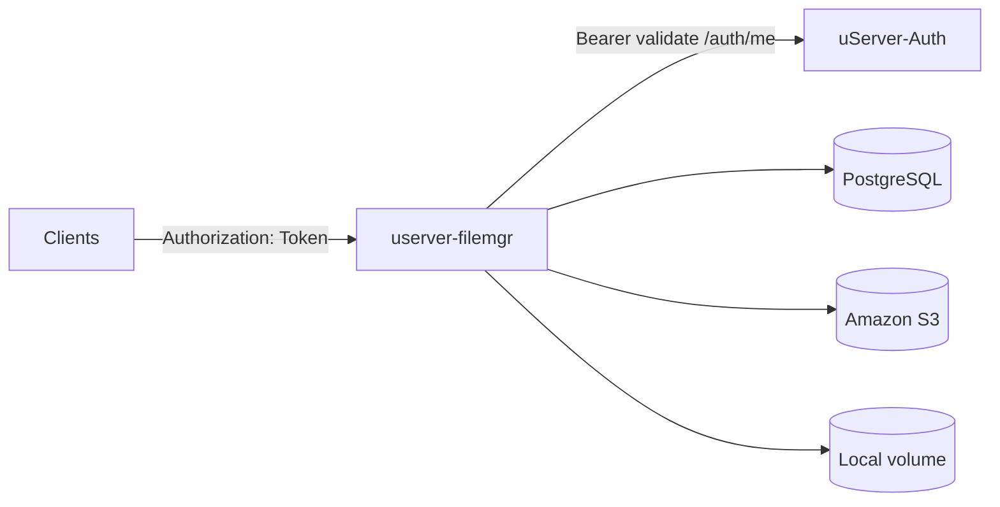

# Architecture and topology

## Role

**userver-filemgr** is an HTTP API that manages logical **storages** (Amazon S3 or local disk), **files** inside each storage, **storage-level ACLs** (which users may read/write), and short-lived **download records** (with presigned URLs for S3 or same-origin streaming for local storage). It integrates with **uServer-Auth** for bearer-token validation and caches issued tokens in PostgreSQL (`core_usertoken`) for performance.

## Topology

Typical deployment:

- One **userver-filemgr** container (or process) behind a reverse proxy. The release image includes **ffmpeg** (and **`ffprobe`**) for video metadata; `FFPROBE_PATH` defaults to `/usr/bin/ffprobe`, and if unset locally the app uses `exec.LookPath("ffprobe")` when available.
- **PostgreSQL** holds all metadata (users mirrored from Auth, storages, files, permissions, download rows).
- **S3** or a **mounted volume** holds object bytes; credentials live in `core_storage.credentials` (JSON).

## HTTP surface

- `GET /healthz` — liveness (no auth).
- `GET|POST /storages` — admin only.
- `GET|PUT|PATCH|DELETE /storages/:id` — admin only.
- File operations under `/storages/:storageId/files/...` — authenticated; visibility rules and `core_storageuser` gates apply (see code in `internal/data/files.go`).
- Trash, storage users, uploads, and download creation follow the same `/storages/...` prefix as the previous API.

## Authentication (userver-auth)

- Clients send **`Authorization: Token <access_token>`** or **`Authorization: Bearer <access_token>`** (access JWT from userver-auth login/register/refresh).
- The service first looks up **`core_usertoken`**; on miss it calls **`GET {USERVER_AUTH_HOST}/auth/me`** with **`Authorization: Bearer <token>`**, then upserts **`core_customuser`** and caches the token. Inactive local users (`is_active = false`) are rejected.
- **`AUTH_HOST`** is an alias for **`USERVER_AUTH_HOST`** when the latter is empty.
- **`setup.sh`** runs **`bootstrap:auth`** after migrations (unless **`SKIP_AUTH_BOOTSTRAP=1`**): optional **`POST /auth/system`** (`Authorization: Token <SYSTEM_CREATION_TOKEN>`) and **`POST /auth/register`**, matching [userver-auth](https://github.com/ferdn4ndo/userver-auth) HTTP contracts.

## Security notes

- **Credentials**: storage JSON credentials are never returned on list/get responses (`json:"-"` on the struct).
- **TLS**: set `ENV_MODE=prod` so the app uses `sslmode=require` for Postgres.
- **CORS**: defaults to `AllowedOrigins: *` with `AllowCredentials: false`; tighten for production if browsers call the API directly.
- **Upload-from-URL**: server-side fetch is capped (see `router.go`) to limit abuse.

## Process model

The HTTP server runs **in-process media workers** (goroutines) that consume a **PostgreSQL-backed queue** (`media_processing_jobs`). Claiming uses `FOR UPDATE SKIP LOCKED`, so multiple replicas can run workers safely without double-processing the same job.

- **Images**: decode with auto-orientation, optional EXIF (stored on the parent `core_storagefile` and in `core_storagemediaimage`), JPEG thumbnails at small/medium/large sizes as separate `core_storagefile` rows linked via `core_storagemediathumbnail`.
- **Video**: optional `ffprobe` when `FFPROBE_PATH` is set and the object is within `MEDIA_MAX_VIDEO_PROBE_BYTES`; dimensions and duration are written to `core_storagemediavideo`.
- **Documents (PDF)**: a minimal `core_storagemediadocument` row is created; page counts and rasterization are not implemented.
- **`core_storagemediaimagesized`**: legacy Django table for alternate image dimensions; the Go service does not populate it (thumbnails use `core_storagemediathumbnail` instead). Existing rows remain readable if you query the DB directly.

Tune with `MEDIA_PROCESSING_ENABLED`, `MEDIA_WORKER_COUNT`, `MEDIA_WORKER_POLL_MS`, `MEDIA_MAX_IMAGE_BYTES`, `MEDIA_MAX_VIDEO_PROBE_BYTES`, and `FFPROBE_PATH` (see `.env.template`).
